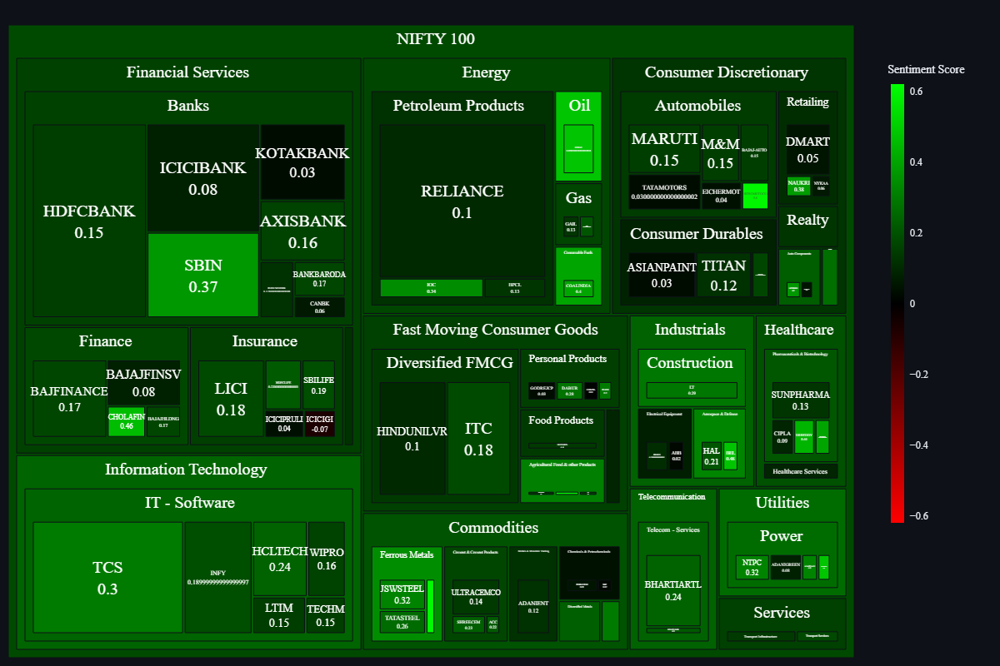

# Sentiment Driven Stock Analysis

In 2020, India witnessed a stock market crash during the COVID-19 pandemic. Understanding sentiment's impact became crucial as fear and uncertainty drove irrational behavior. Sentiment analysis helps investors gauge emotions, make informed decisions, and complement other analyses for a comprehensive investment strategy based on risk tolerance and goals.

### A live Sentiment Analysis Dashboard powered by python and streamlit.
### Live instances of the app can be found [Streamlit Cloud](https://nifty-500-stock-sentiment.streamlit.app/)

